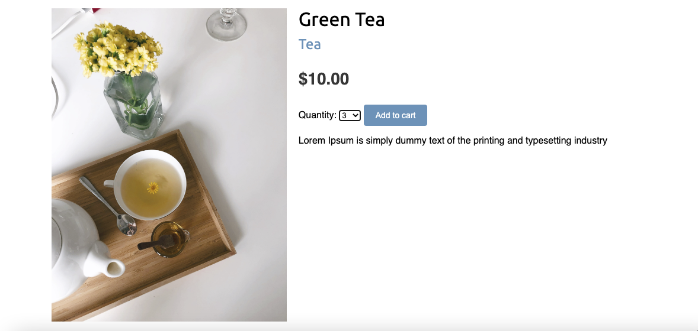
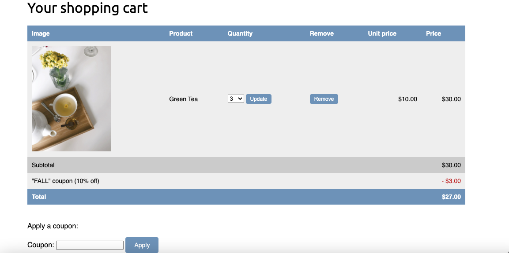
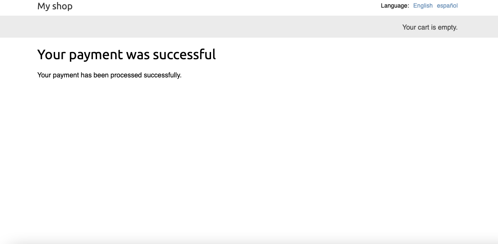

# Senay Store App

  Senay Store App

    <em>The awesome tool to create python projects.</em>

## Steps to Run the Application

Pull the repository into your device and run it as you used to run Django Application.

-   (You need to install 'requirements.txt' if you don't have these already)

-   (You also need to build React Application as it has been ignored in git and also need node_modules.)

-   Note: You need to provide your Google Account Details in Settings File.

OR You can simply go through the below link.

### Link: https://senaystore.herokuapp.com

## User View

### 1. Home Page

When you first open the application, you will see the home page where you can see the search options and default search results just below. You will see two menu icons (One at right top and another at left top).

### 2. Listing Page

You can see all the listings here.

### 3. About Page

In about page, you can see about the company, top sellers and listed sellers.

### 4. Contact Page

There is a seperate contact page from where you can contact to the company. You will also get response email after sending messages.

### 5. Login and Signup Page

You need an account to view the details page and make order. For that you just need to go to Signup page and create an account.

### 6. Details Page

You can view the details page after logging in. You can see the complete details about the house/condo/townhouse in this page. You can also see the images and description of those and about the seller also. You can also contact the seller directly from the contact section.
If you want to buy, then you just need to click on "BUY NOW" button.

### 7. Buy Page

You can use "DISCOUNT100" coupon to buy that item. If you could buy that item successfully, then you will get confirmation message there only.

### 8. Profile Page

In profile page, you can see about your info as well as the orders you have made. You can see your buyings on clicking on the Item Name coloured in blue.

### 9. Brought Page

You can see full details about what you have brought.

### 10. Admin Page

From the admin page, you can manage almost all things.

## Thank You

## Senay Berhe

